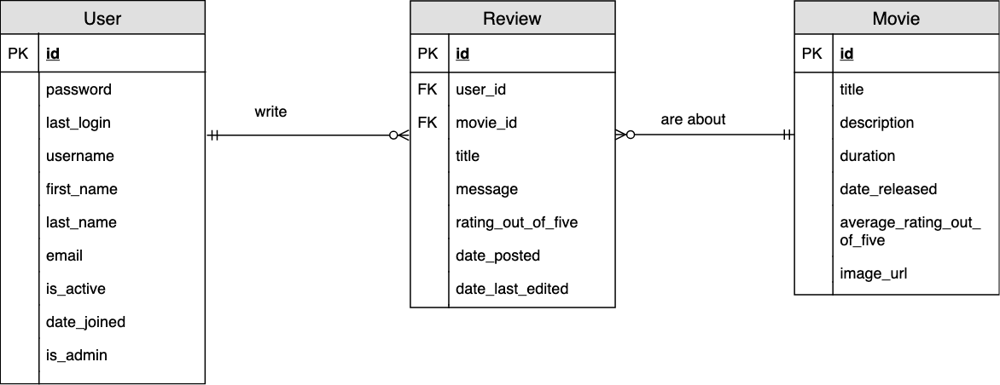
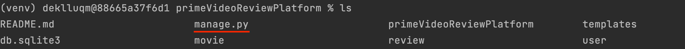
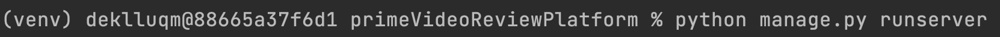

# Introduction
A web app was created as a proof of concept to make it easier for users of Prime Video to browse through all the movies and quickly see information about it as well as reviews about it that have been written by other users. Reviews contain information about the movie it was written for, who the review was written by, the score out of five, a title and a message. It also contains the dates of when the review was created and last edited.

There is a navigation bar at the top that is present on all pages, it includes a hyperlink to go to the home page or to login (or logout, if the user is already logged in). On the login page, the user can enter their account details to login, but if they do not have an account, they can click the link on the login page to allow them to register an account.

The app involves a home page that displays all movies in the database. The movies have been paginated to include a limit of 8 movies per page to balance between convenience and aesthetics. When a movie is clicked, the user is shown a more detailed view of the movie, including cover art, title, the average rating out of five (calculated from all the reviews, and each time a review is added, edited or deleted this is re-calculated). 

Of course this would be inefficient for a real world application, however this is only a proof of concept web app and as such this is ok. If the app needed to use a more efficient way of doing this, a separate counter could be kept to track the total number of reviews and the sum of the ratings, and then to update these values each time a review was created, updated or deleted. This would reduce unnecessary database reads because the review table would not need to be read from each time one of these actions happened.

The user can press a hyperlink on this page to take them to the reviews, which displayes all the reviews associated with that movie.

After registering an account, the new user is able to write a review on any of the movies listed. The database has a constraint to only allow a user to write one review per movie. Once they have written a review, they can edit aspects of the review such as the title, message or five star rating. The web app has access control to ensure that users can only do this for their own reviews. Users who try to do this while not being logged in are redirected to the log in page.

There are a special subset of users called admins. These users have special permissions, specifically to delete reviews. They were not given an option to edit anyone elses review as the role of an admin is to remove inappropriate reviews. Allowing them to edit a user's review would be a violation of trust. As their role is to moderate reviews, they were given no permissions regarding the movies table or users table. If they were given these permissions, it would be a violation of the least privilege principle.

Forms in this application include validation and will display error messages to inform users of bad input.

An ERD (entity-relationship diagram) can be seen below:

# Run unit tests

Tests must be run per app, which this project has 3 of: user, review and movie

Navigate to the root folder that has the manage.py file and then run:

python manage.py test {app.name}.tests

Replace {app.name} with one of the app names, e.g:

python manage.py test user.tests

# How to run the app and test it locally

This program uses python 3.9 and django

You must have python 3.9 and django installed to run this project

Open the command line and navigate to the primeVideoReviewPlatform folder

If you use the terminal to display the contents of this folder, you should see a file called manage.py

Run the terminal command 'python manage.py runserver'
(Note that this project uses python 3.9)

The console should output something like below

Navigate to the link provided (often is http://127.0.0.1:8000/)

You can now access the website

# Sample user login details

Below are the account details of a regular user which can be used to log in to the website, please note that the username and password are both case sensitive:

Username – theDudeHimself

Password – hunter2

An admin account is also provided below to login to the website from the admin’s perspective:

Username – random_guy

Password - Adminpassword123

